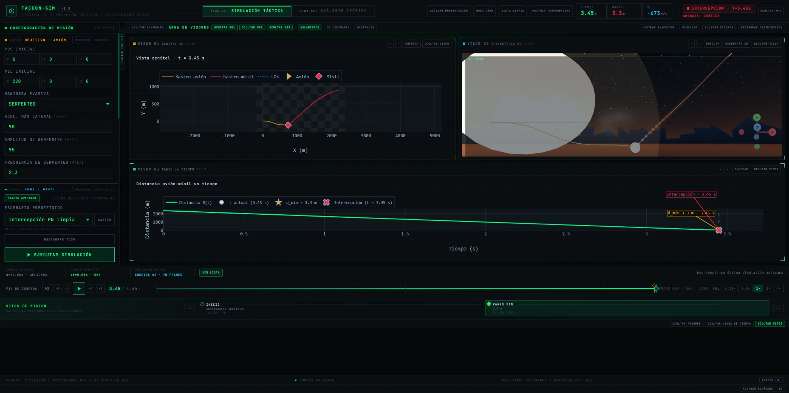
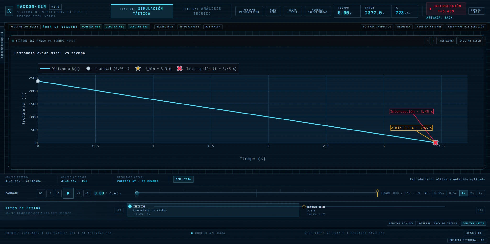
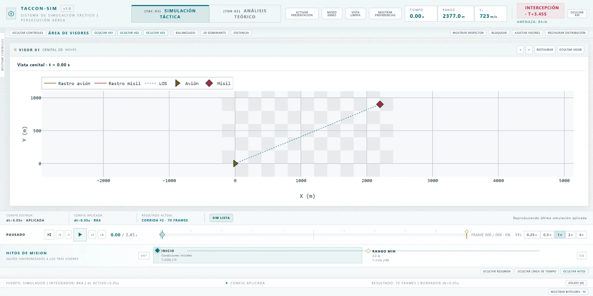

# Aerial Pursuit Simulation

Interactive simulation of an aircraft–missile pursuit scenario developed collaboratively.

The application combines numerical simulation with interactive controls and visual representations of trajectories, distances, and system behavior.

## Screenshots

The screenshots show the tactical simulation workspace, an interception scenario, distance analysis, an alternative light-themed 2D view, and mathematical foundations illustrated with equations and step-by-step explanations. Select an image to view it at full resolution.

<table>
  <tr>
    <th colspan="2">Tactical Simulation</th>
  </tr>
  <tr>
    <td colspan="2" align="center"><a href="docs/screenshots/tactical-simulation.webp"></a></td>
  </tr>
  <tr>
    <th>Interception Result</th>
    <th>Distance Analysis</th>
  </tr>
  <tr>
    <td align="center"><a href="docs/screenshots/interception-result.webp"></a></td>
    <td align="center"><a href="docs/screenshots/distance-analysis.webp"></a></td>
  </tr>
  <tr>
    <th>Light Theme / 2D Trajectories</th>
    <th>Mathematical Theory & Equations</th>
  </tr>
  <tr>
    <td align="center"><a href="docs/screenshots/light-theme-2d.webp"></a></td>
    <td align="center"><a href="docs/screenshots/theory-topics.webp"></a></td>
  </tr>
</table>

## Tech Stack

- React
- TypeScript
- Vite
- Three.js
- React Three Fiber
- Plotly
- KaTeX
- Vitest

## Features

- Aircraft and missile simulation
- Pursuit-guidance calculations
- Numerical integration
- Configurable maneuvers
- 2D trajectory visualization
- 3D trajectory visualization
- Distance analysis
- Mathematical formulas and theory
- Simulation playback controls
- Automated tests for numerical logic

## Running Locally

Install dependencies:

```bash
npm install
```

Start the development server:

```bash
npm run dev
```

Build the application:

```bash
npm run build
```

Run tests:

```bash
npm test
```

## Documentation

Supporting data contracts and example simulation results are available under docs/.

```text
docs/
```

## Scope

The project focuses on numerical modeling, visualization, and interactive analysis of aircraft–missile pursuit scenarios.
